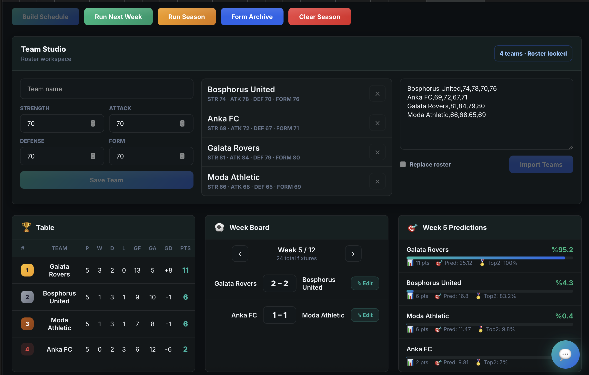

# League Simulation



League Simulation is a local football league workspace for building a custom roster, generating a balanced season schedule, simulating match weeks, editing results, and forecasting the final table with Monte Carlo runs.

The app includes a Go API, PostgreSQL persistence, a static Vue dashboard, and an optional OpenAI-powered league analyst. It works without an API key by falling back to deterministic local analysis.

## Features

- Create, update, delete, and bulk import teams from the dashboard
- Generate quadruple round-robin schedules for any even roster of 4 or more teams
- Simulate the next week or the full remaining season
- Edit individual match scores and immediately recalculate the table
- Forecast title and top-two probabilities after week 4
- Inspect seeded form archive data when available
- Chat with a read-only analyst that can use standings, fixtures, forecasts, and form archive tools

## Stack

| Technology | Purpose |
|---|---|
| Go 1.22 | API and application server |
| Gin | HTTP routing |
| PostgreSQL 16 | Persistence |
| sqlx | SQL query mapping |
| Vue 3 | Static dashboard |
| Docker Compose | Local runtime |

## Architecture

```text
Handler (HTTP) -> Service (business rules) -> Repository (SQL)
```

`cmd/server/main.go` wires configuration, database, repositories, services, handlers, and routes. The Go server also serves the frontend from `frontend/`.

## Run Locally

```bash
docker compose up --build
```

Open:

```text
http://localhost:8080
```

If you already have an older database volume from a previous project name, reset it once:

```bash
docker compose down -v
docker compose up --build
```

Optional AI analyst:

```bash
export OPENAI_API_KEY="your-api-key"
export OPENAI_MODEL="gpt-4.1-mini"
docker compose up --build
```

## Roster Import Format

The dashboard accepts comma, semicolon, or tab separated rows:

```text
Name,Strength,Attack,Defense,Form
Bosphorus United,74,78,70,76
Anka FC,69,72,67,71
Galata Rovers,81,84,79,80
Moda Athletic,66,68,65,69
```

Ratings are 1-100. If attack, defense, or form are omitted, League Simulation uses the strength value.

## API

Base URL:

```text
http://localhost:8080/api/v1
```

Core endpoints:

| Method | Path | Description |
|---|---|---|
| GET | `/health` | API and database status |
| GET | `/teams` | List teams |
| POST | `/teams` | Create or update one team by name |
| POST | `/teams/import` | Bulk upsert or replace teams |
| DELETE | `/teams/:id` | Delete a team before fixtures exist |
| POST | `/fixtures/generate` | Generate the season schedule |
| GET | `/matches` | List all matches |
| GET | `/matches/week/:week` | List matches for a week |
| PUT | `/matches/:id` | Edit a match result |
| POST | `/play/week` | Simulate the next unplayed week |
| POST | `/play/all` | Simulate every remaining week |
| GET | `/standings` | Get the calculated table |
| GET | `/predictions` | Get Monte Carlo forecasts |
| GET | `/historical-stats` | Get form archive aggregates |
| GET | `/historical-matches` | Search archived match samples |
| POST | `/agent/chat` | Ask the analyst |
| POST | `/reset` | Clear current-season fixtures and results |

Team changes are locked while fixtures exist. Use `POST /reset` first when you want to edit the roster for a new season.

## Development

Run tests:

```bash
go test ./...
```

Build the server:

```bash
go build ./cmd/server
```
